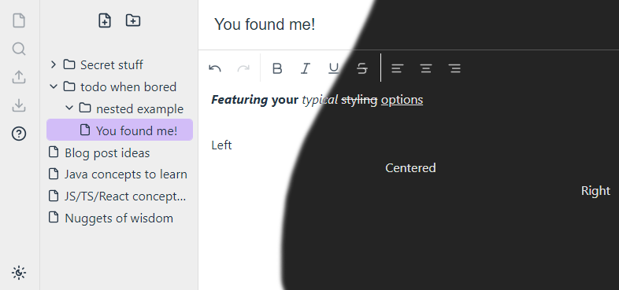

<h1 align="center">
  <a href="https://engrave.live/">Engrave</a>
</h1>

Engrave is a FOSS web-based note-taking app & editor, being built with the intention of remaining 'snappy', and to rival the UX of your favorite technologies.

### Technologies at play
- JavaScript / TypeScript / React
- MobX for state management
- Facebook's [Lexical](https://github.com/facebook/lexical) as the WYSIWYG editor
- Atlassian's [Pragmatic Drag & Drop](https://github.com/atlassian/pragmatic-drag-and-drop) for the unstyled & hugely customizable Drag & Drop foundation

There's little more to say; [jump on in](https://engrave.live/) and give it a try!

_Engrave is in early development. Numerous features are still on the horizon, and feedback / suggestions are very welcome._